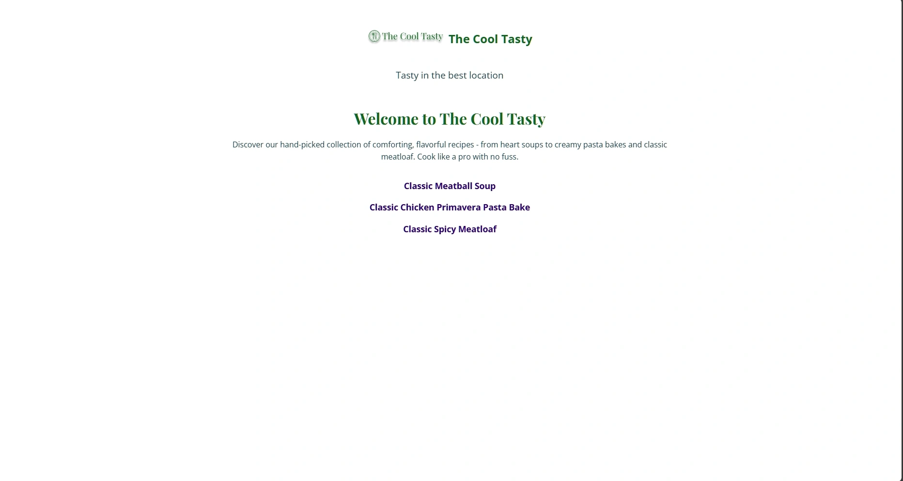

# The Cool Tasty (Recipe Page)

A responsive and accessible recipe website “The Cool Tasty” built using **HTML5** and **CSS3**, with semantic structure and performance optimization. This project showcases clean design, WebP image support, lazy loading, and accessibility best practices.

## Features

- ✅ Responsive design for all devices
- ✅ Semantic HTML structure
- ✅ Accessibility-optimized (Wave, Lighthouse 100)
- ✅ WebP images and lazy-loading
- ✅ Clean and modular CSS

## Live Demo

[🔗 View Project](https://quiklydev.github.io/Recipe_Page/)

## 📸 Preview

### Desktop

### Mobile

## Lighthouse Audit Results

| Page                                   | Device  | Performance | Accessibility | Best Practices | SEO  |
|-------------------------------------------|-------------|-------------|----------------|----------------|------|
| `/index.html`                             | Desktop     | 100         | 100             | 81            | 100   |
| `/index.html`                             | Mobile      | 99          | 100             | 82            | 100   |
| `/meatball-soup.html`                     | Desktop     | 99         | 100             | 81            | 100   |
| `/meatball-soup.html`                     | Mobile      | 96          | 100             | 82            | 100   |
| `/chicken-primavera-pasta-bake.html`     | Desktop     | 99         | 100             | 81            | 100   |
| `/chicken-primavera-pasta-bake.html`     | Mobile      | 95          | 100             | 82            | 100   |
| `/classic-spicy-meatloaf.html`           | Desktop     | 99         | 100             | 81            | 100   |
| `/classic-spicy-meatloaf.html`           | Mobile      | 95          | 100             | 82            | 100   |
> _Note: Lighthouse scores may vary slightly between runs due to emulated network/CPU conditions. All pages maintain consistently high scores across core metrics._

## Technologies Used
- HTML5
- CSS3 (Flexbox, Media Queries)
- Google Fonts
- WebP images
- Lazy-loading
- Semantic HTML
- Lighthouse, W3C, WAVE validators 

## Validation 

- ✅ HTML5 validated via [W3C Validator](https://validator.w3.org/)
- ✅ CSS3 validated via [W3C CSS Validator](https://jigsaw.w3.org/css-validator/)
- ✅ Accessibility tested via [WAVE](https://webaim.org/)

## Project Structure

Recipe_Page/
├── index.html
├── recipe.css
├── images/
│   ├── pexels-photo-4103375.webp
│   └── ...
├── assets/
│   └── favicon/
├── recipes/
│   ├── meatball-soup.html
│   ├── chicken-primavera-pasta-bake.html
│   └── classic-spicy-meatloaf.html
├── index.js
├── LICENSE
├── package.json
└── README.md

## Feedback & Bugs
Found an issue? Create an issue here: https://github.com/quiklydev/Recipe_Page/issues

**Migrated to @quiklydev**  
Live demo: https://quiklydev.github.io/Recipe_Page  
Maintained by: [@quiklydev](https://github.com/quiklydev)  
Contact: quiklydev.dev@gmail.com

## LICENSE

This project is licensed under the ISC LICENSE.
